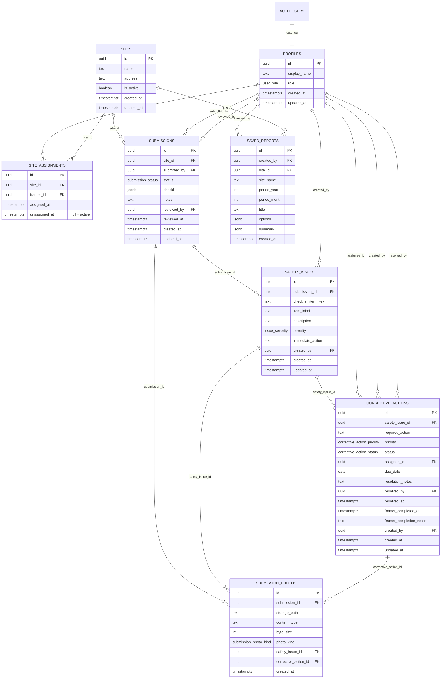

# RAS SiteSafe

**Mobile-first site safety form + compliance dashboard** for [Ron Anderson & Sons](https://www.ronandersonandsons.com/) — built as a junior developer technical assessment.

Framers complete a Daily Safety Check (with site/hazard photos) from a phone. Admins review submissions, manage Safety Issues / corrective actions, track Daily Compliance, and export aggregate monthly reports with an appendix.

| | |
| --- | --- |
| **Live app** | **[https://ras-sitesafe.vercel.app](https://ras-sitesafe.vercel.app)** |
| **Repository** | [https://github.com/lelandsion/ras-sitesafe](https://github.com/lelandsion/ras-sitesafe) |

---

## Tech stack

| Layer | Choice |
| --- | --- |
| UI | React + TypeScript |
| Build | Vite |
| Backend | Supabase (Auth, Postgres, Storage) |
| Routing | React Router |
| Charts | Recharts |
| Icons | Lucide |
| Hosting | Vercel |

---

## Features

- **Login & roles** — Supabase Auth; route guards for `admin` and `framer` (no public sign-up)
- **Account** — `/account` profile summary (email, role, assigned sites, activity)
- **Sites & assignments** — Admin Sites tab: manage jobsites; assign/unassign framers (`site_assignments` with soft-unassign history)
- **Framer Daily Safety Check** — assigned jobsites, checklist (PPE / fall / tools), hazards & incidents, **Save draft** or **Submit**
- **Photos** — JPEG/PNG/WebP via `photo_kind` (`site` / `hazard` / `issue` / `resolution` / `corrective_action`); issue evidence when answering **No**
- **Safety issues** — field capture on checklist failures; Admin **Safety Issues** queue with filters (All / Ready for review / Open / In progress / Resolved / No CA)
- **Corrective actions** — admin create CA → In progress → framer **Ready for review** (`framer_completed_at`) → admin **Resolve** (resolution notes)
- **Reviewed label** — admin marks submissions **Reviewed** (DB status `approved`; UI label “Reviewed”)
- **Admin dashboard** — compliance metrics, charts, submission filters (site / worker / dates / issues / status), click-through to form
- **Daily Compliance** — Sites → Daily Compliance crew status (Assigned / Submitted / Missing / Issues) with date + tabs; uses assignment history for accurate Missing
- **Aggregate reports** — monthly site Safety Report: compliance tiles, top issues, charts, notable issues, collapsible **Appendix** (all period issues + photos, all CA statuses + no-CA), PDF export, `saved_reports`
- **PDF export** — daily-check PDF and branded monthly period PDF

---

## Test credentials

Demo accounts for assessors (fictional identities — not personal emails). Shared password for both:

| Role | Name | Email | Password |
| --- | --- | --- | --- |
| Admin | Sarah Mitchell | `admin@ras-sitesafe-demo.com` | `testpassword` |
| Framer | Daniel Ortiz | `framer@ras-sitesafe-demo.com` | `testpassword` |

> Seed Auth users in Supabase first — see [`docs/supabase-seed-notes.md`](docs/supabase-seed-notes.md).

---

## Setup / local development

```bash
git clone https://github.com/lelandsion/ras-sitesafe.git
cd ras-sitesafe
npm install
cp .env.example .env.local
```

Fill `.env.local` (never commit real values):

```env
VITE_SUPABASE_URL=https://your-project.supabase.co
VITE_SUPABASE_ANON_KEY=your-publishable-or-anon-key
```

Use the **publishable / anon** key only — never the service role key. Keep [`.env.example`](.env.example) as an empty template for redistributors.

```bash
npm run dev
```

Dev server: [http://127.0.0.1:4321](http://127.0.0.1:4321) (port `4321` in `vite.config.ts`).

## Testing

```bash
npm test          # Vitest watch mode
npm run test:run  # single CI run
```

Manual QA: [`docs/test-plan.md`](docs/test-plan.md).

### Apply schema (once)

1. Paste migrations from [`supabase/migrations/`](supabase/migrations/) in Supabase → **SQL Editor** (in filename order), or
2. `npx supabase login` → `npx supabase link` → `npx supabase db push`

Then create the demo Auth users and seed jobsites — [`docs/supabase-seed-notes.md`](docs/supabase-seed-notes.md). Full paste-ready SQL parts (if maintained in your project docs pack): `docs/supabase-manual-sql.md`.

---

## ERD

Current schema (aligned with [`supabase/migrations/`](supabase/migrations/) through `20261003000801_*`). Mermaid is the source of truth — see below and [`docs/ras-sitesafe-erd.md`](docs/ras-sitesafe-erd.md).

**Tables:** `profiles`, `sites`, `site_assignments`, `submissions`, `submission_photos`, `safety_issues`, `corrective_actions`, `saved_reports`

**Enums**

| Enum | Values |
| --- | --- |
| `user_role` | `admin` \| `framer` |
| `submission_status` | `draft` → `submitted` → `under_review` → `approved` \| `rejected` (`approved` UI label: **Reviewed**) |
| `submission_photo_kind` | `site` \| `hazard` \| `issue` \| `resolution` \| `corrective_action` |
| `issue_severity` | `low` \| `medium` \| `high` |
| `corrective_action_status` | `open` → `in_progress` → `ready_for_review` → `resolved` |
| `corrective_action_priority` | `low` \| `medium` \| `high` |



**Notes**

- **Assignment history:** soft-unassign via `site_assignments.unassigned_at` so Daily Compliance “Missing” stays accurate for past dates.
- **Corrective actions:** framer marks `ready_for_review` (sets `framer_completed_at` / optional `framer_completion_notes`); only admin resolves.
- **Period reports:** aggregate by checklist `checkDate` for the site/month; appendix includes issues in all CA statuses plus issues with no CA yet.
- **Migrations:** apply [`supabase/migrations/`](supabase/migrations/) in filename order. Seed + smoke: [`docs/supabase-seed-notes.md`](docs/supabase-seed-notes.md), [`docs/test-plan.md`](docs/test-plan.md).

---

## Assumptions

- Internal RAS tool — accounts are provisioned by an admin; **no public sign-up**
- Roles on `profiles.role`: **`admin` | `framer`** only
- Postgres **RLS** on all app tables; photos in private bucket `submission-photos`
- Photos: JPEG / PNG / WebP, max **~8 MiB** each
- Official RAS logo sourced from RAS (not invented)
- Demo emails are fictional assessment identities
- Built for a Canadian construction-company assessment context (demo jobsite data)

---

## Project structure

```
src/
  components/   # auth guards, layout, form photo upload, admin chart/reports
  pages/        # login, admin, framer, account
  hooks/        # AuthProvider / useAuth
  services/     # Supabase client calls (sites, submissions, photos, issues, CA, reports)
  lib/          # analytics, period report, PDF export, filters
  types/        # DB / domain types
supabase/migrations/   # schema, enums, RLS, storage policies
docs/                  # ERD, seed notes, test plan
```

---

## Deploy

Production is on Vercel: **[https://ras-sitesafe.vercel.app](https://ras-sitesafe.vercel.app)**

SPA routes are rewritten via `vercel.json`. Required env vars (Production + Preview): `VITE_SUPABASE_URL`, `VITE_SUPABASE_ANON_KEY`.
