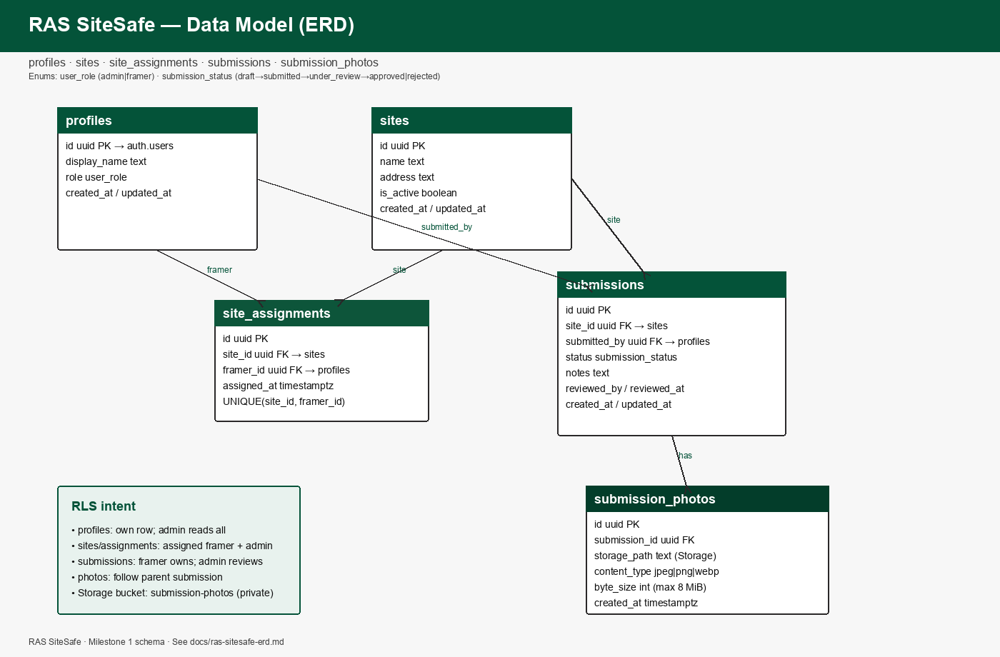

# RAS SiteSafe

Mobile-first construction safety form and compliance dashboard built for **Ron Anderson & Sons**.

RAS SiteSafe helps framing crews submit site safety checks from the field and gives admins a clear compliance view — phone-first, brand-aligned, and ready for jobsite use.

## Tech stack

- Vite + React + TypeScript
- Supabase (Auth, Postgres, Storage)
- React Router
- Recharts (dashboard — after login milestone)
- Lucide React

## Setup

```bash
npm install
cp .env.example .env.local
# Fill VITE_SUPABASE_URL and VITE_SUPABASE_ANON_KEY from your Supabase project
# Use the publishable key (sb_publishable_…) as VITE_SUPABASE_ANON_KEY — never the secret/service_role key
npm run dev
```

Dev server: [http://127.0.0.1:4321](http://127.0.0.1:4321)

### Apply database schema

Schema SQL lives in [`supabase/migrations/20261002000100_sitesafe_schema.sql`](supabase/migrations/20261002000100_sitesafe_schema.sql). Apply via Supabase Dashboard → SQL Editor, or `npx supabase login` + `npx supabase link` + `npx supabase db push`. Seed steps: [`docs/supabase-seed-notes.md`](docs/supabase-seed-notes.md).

## Assumptions

- Supabase project already exists; wire URL + publishable/anon key via `.env.local` (never commit secrets).
- Roles live on `profiles.role`: `admin` | `framer`.
- Official RAS logo is sourced from RAS site/Instagram into `src/assets/branding/` (not invented).
- Assessment demo accounts are fictional SiteSafe identities (not personal emails).
- Photo uploads (later milestone): jpeg/png/webp, max ~8 MiB, private Storage bucket `submission-photos`.

## Test Credentials

| Role   | Name           | Email                          | Password |
| ------ | -------------- | ------------------------------ | -------- |
| Admin  | Sarah Mitchell | `admin@ras-sitesafe-demo.com`  | *(set when seeding Supabase Auth — see docs/supabase-seed-notes.md)* |
| Framer | Daniel Ortiz   | `framer@ras-sitesafe-demo.com` | *(same shared demo password once seeded)* |

## ERD



- Image: [`docs/ras-sitesafe-erd.png`](docs/ras-sitesafe-erd.png)
- Notes / Mermaid: [`docs/ras-sitesafe-erd.md`](docs/ras-sitesafe-erd.md)

## Deployed app

- *(Vercel production URL — add after connecting GitHub → Vercel)*

## Repo

Public GitHub: [https://github.com/lelandsion/ras-sitesafe](https://github.com/lelandsion/ras-sitesafe)

Import in Vercel (Framework: Vite, root = repo root), set `VITE_SUPABASE_URL` and `VITE_SUPABASE_ANON_KEY`, then paste the production URL above.
