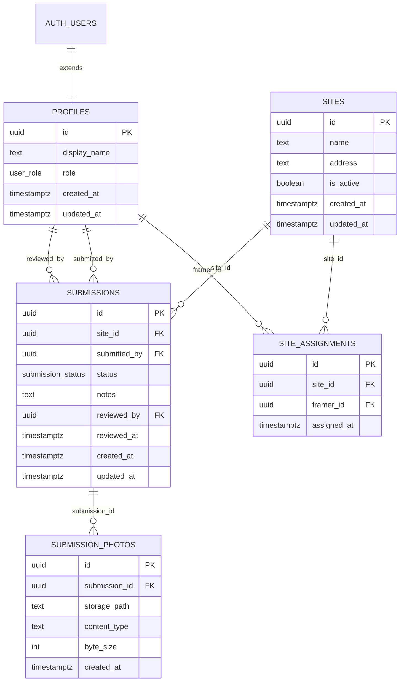

# RAS SiteSafe — Entity Relationship Diagram

Tables: `profiles`, `sites`, `site_assignments`, `submissions`, `submission_photos`.

Enums:

- `user_role`: `admin` | `framer`
- `submission_status`: `draft` → `submitted` → `under_review` → `approved` | `rejected`

See rendered image: [ras-sitesafe-erd.png](./ras-sitesafe-erd.png)

