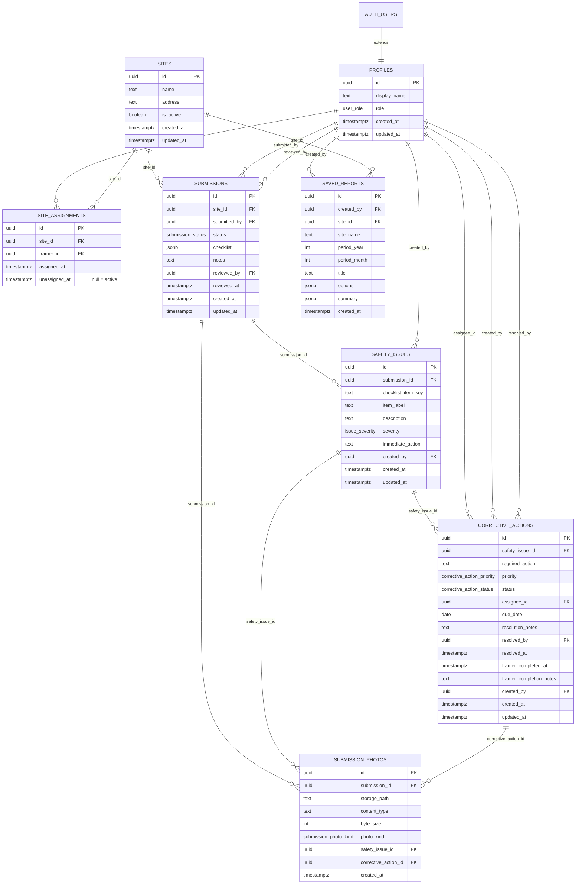

# RAS SiteSafe — Entity Relationship Diagram

Tables: `profiles`, `sites`, `site_assignments`, `submissions`, `submission_photos`, `safety_issues`, `corrective_actions`, `saved_reports`.

Enums:

- `user_role`: `admin` | `framer`
- `submission_status`: `draft` → `submitted` → `under_review` → `approved` | `rejected`  
  (`approved` displays as **Reviewed** in the UI)
- `submission_photo_kind`: `site` | `hazard` | `issue` | `resolution` | `corrective_action`
- `issue_severity`: `low` | `medium` | `high`
- `corrective_action_status`: `open` → `in_progress` → `ready_for_review` → `resolved`
- `corrective_action_priority`: `low` | `medium` | `high`

See rendered image: [ras-sitesafe-erd.png](./ras-sitesafe-erd.png)  
(Image may lag the Mermaid below — treat this markdown as source of truth.)

## Notes

- **Assignment history:** soft-unassign via `site_assignments.unassigned_at` so Daily Compliance “Missing” stays accurate for past dates.
- **Corrective actions:** framer marks `ready_for_review` (sets `framer_completed_at` / optional `framer_completion_notes`); only admin resolves.
- **Period reports:** aggregate by checklist `checkDate` for the site/month; appendix lists safety issues in all CA statuses (`open`, `in_progress`, `ready_for_review`, `resolved`) plus issues with no CA yet.
- **Migrations:** `supabase/migrations/` (apply in filename order). Aligned through `20261003000801_*`.
